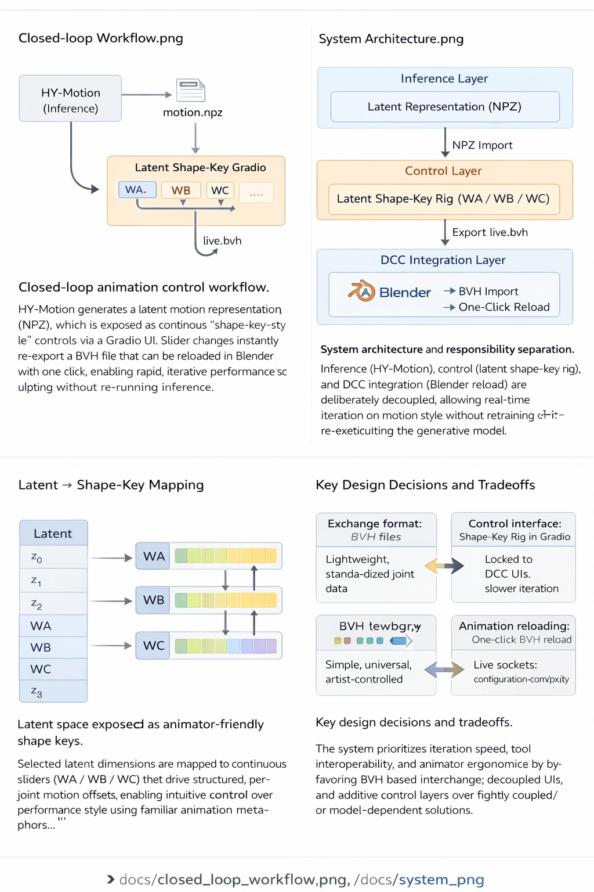
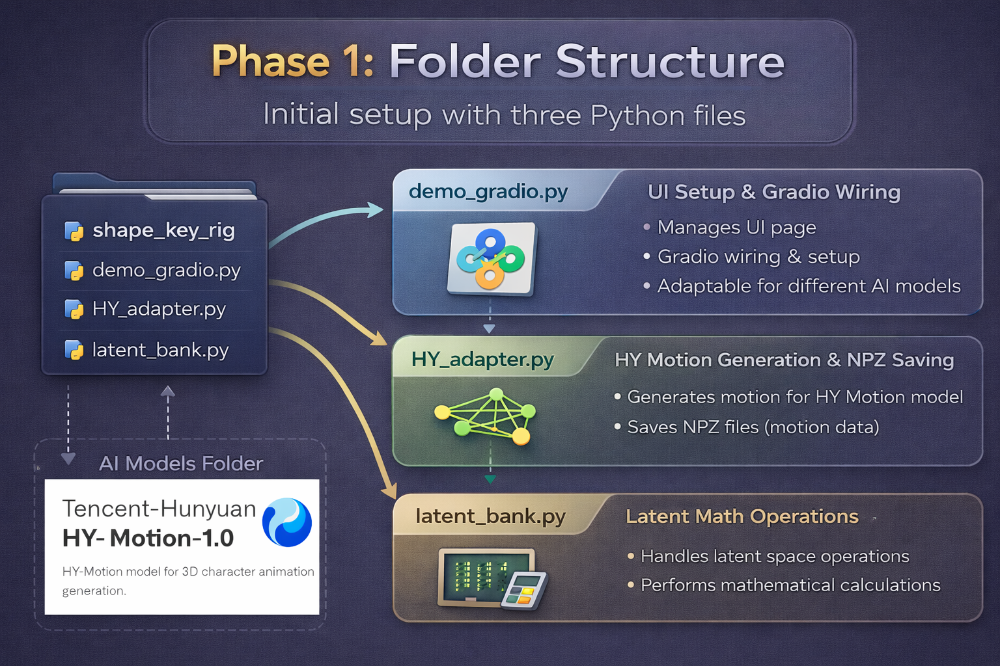
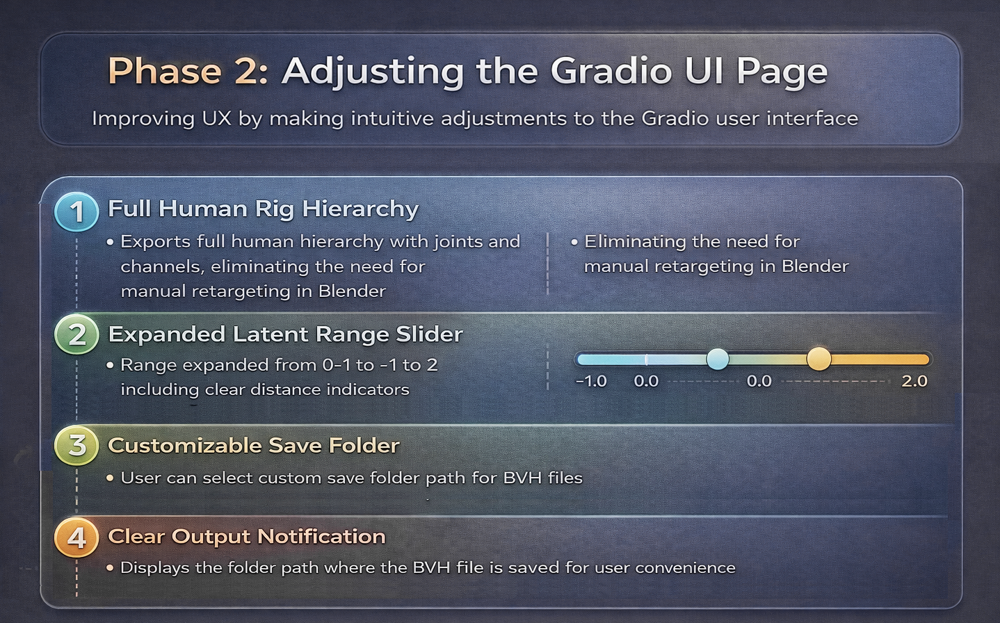
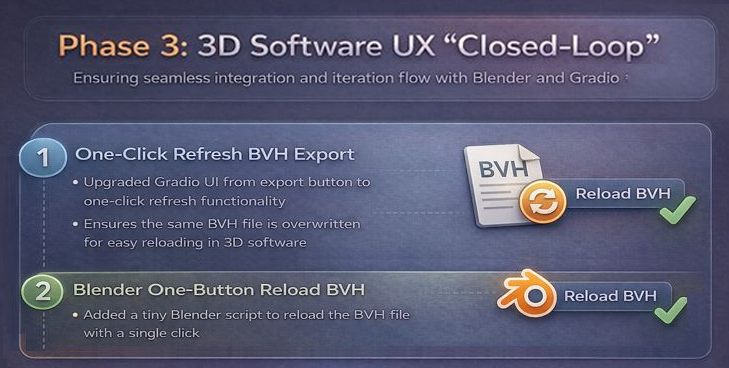
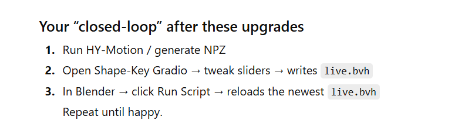

A Blender-friendly “motion shape-key rig” that maps latent controls to joint-space offsets, controlled via Gradio sliders and exported as BVH for instant preview.

(A) How to run the UI
Example (Windows):

cd HY-Motion-Latent-ShapeKey-Rig
pip install -r requirements.txt
python gradio_controls.py

(B) How to use in Blender

import BVH once

run blender_reload_live_bvh.py to reload latest live.bvh

## Technical Roadmap

This roadmap outlines the overall design direction of the Latent Shape Key Rig, from modular architecture to closed-loop DCC integration.

---

## Phase 1 — Folder Structure & System Architecture

This phase focuses on building an intuitive, modular folder structure that:
- Can live inside existing motion AI model repositories (e.g. HY-Motion)
- Can also operate independently as a standalone Gradio-based tool
- Separates UI logic, model adaptation, and latent math for long-term maintainability

---

## Phase 2 — Adjusting the Gradio UI Page

This phase improves usability and creative control by:
- Exporting a full human rig hierarchy (joints + channels) instead of raw BVH-only output
- Expanding latent slider ranges from `[0, 1]` to `[-1, 2]` with clearer distance feedback
- Allowing users to customize the save directory
- Displaying explicit output paths after motion export

---

## Phase 3 — 3D Software UX Closed-Loop (Blender)

This phase closes the iteration loop between AI generation and DCC tools by:
- Upgrading Gradio export to a one-click refresh that overwrites the same BVH file
- Adding a lightweight Blender script for one-button BVH reload
- Enabling rapid iteration without file clutter, similar to native Blender workflows

---

## Closed-Loop Logic Overview

This diagram summarizes the full closed-loop workflow:
Gradio latent control → motion generation → BVH overwrite → Blender reload → visual evaluation → repeat.

The result is an artist-friendly, iteration-focused AI animation pipeline.
